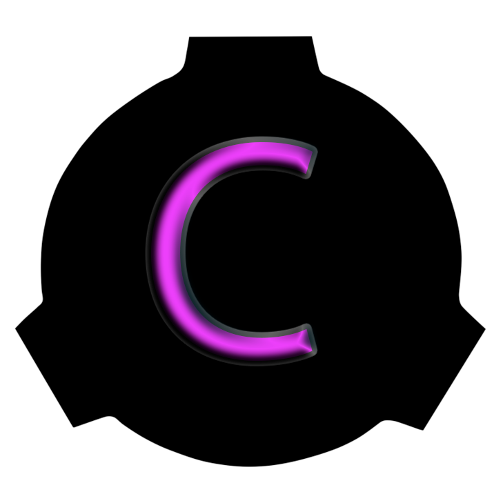

# 20.11.2024

## Общие изменения

Мы переехали на новый более потужный хост, что означает более стабильный TPS на серверах и больше пространства для других проектов


Ip-Адреса серверов не поменялись, т.е из вкладки _**"Избранные"**_ серверы не пропали



**Напоминание**

TPS сервера почти никакого отношения не имеет к проблеме с _**"Телепортацией"**_

TPS сервера никак не влияет на FPS клиента или пинг игрока


## Изменения Classic 1

По результатам публичного опроса, на сервере  Classic 1 снова будет включен урон по союзникам и лимит игроков останется в 40 игроков

## Результаты опроса


Всего поступило **77 ответов**


> Хотите вернуть **урон по союзникам** на **Classic 1** ?

```mermaid
```
