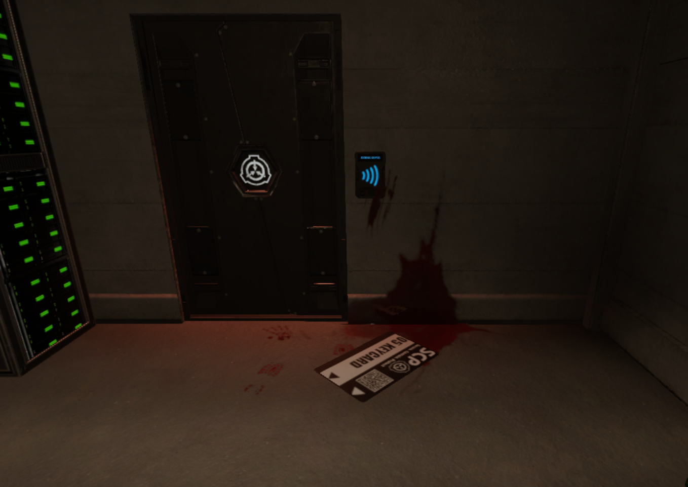
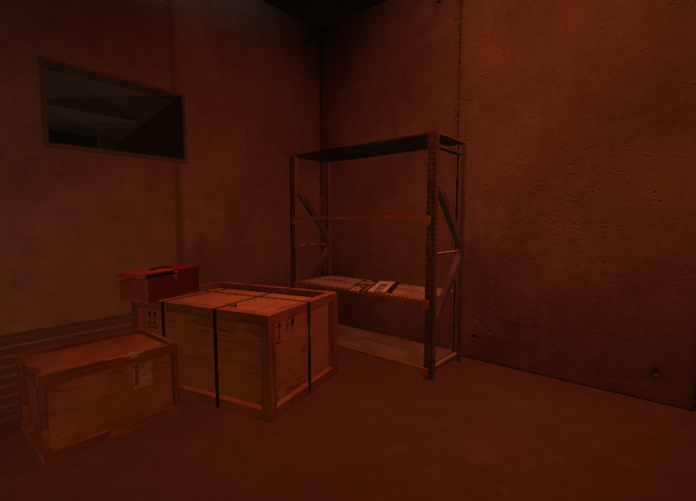
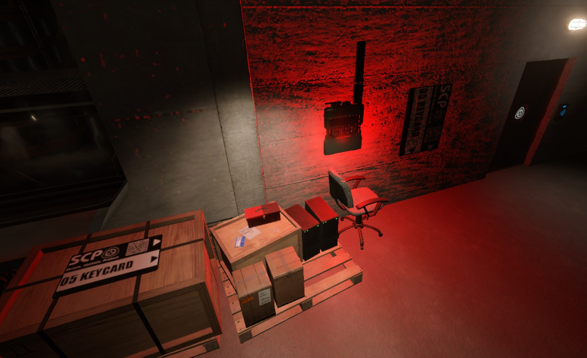
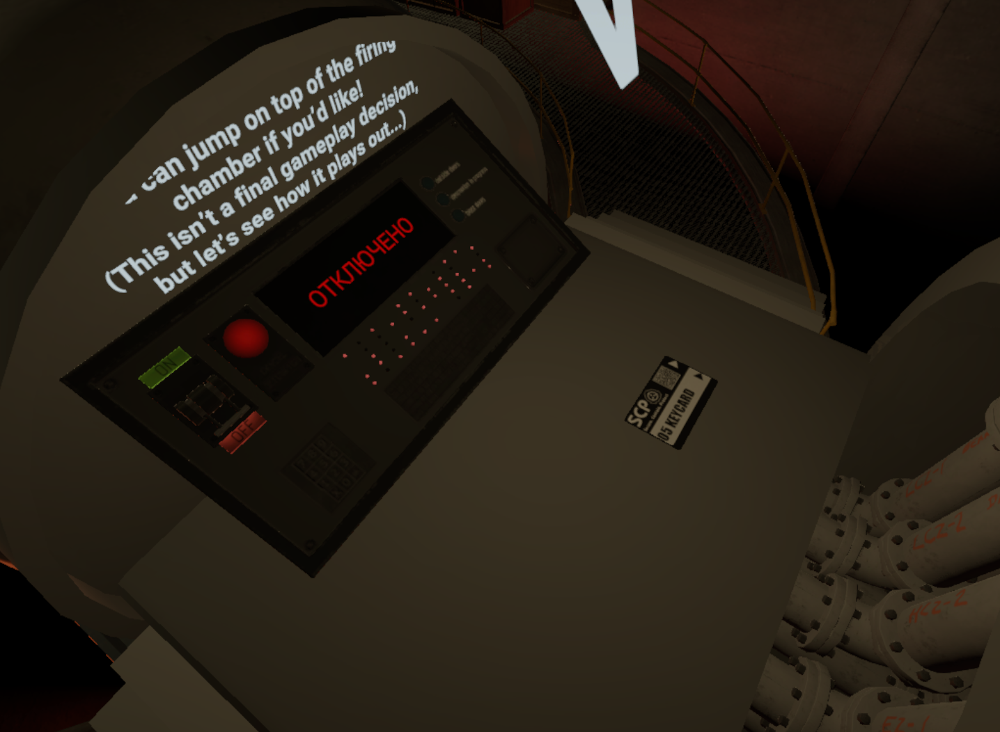
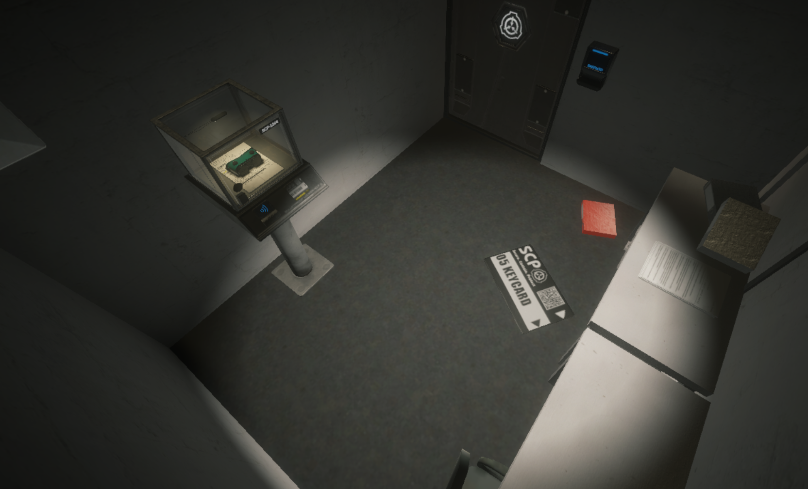
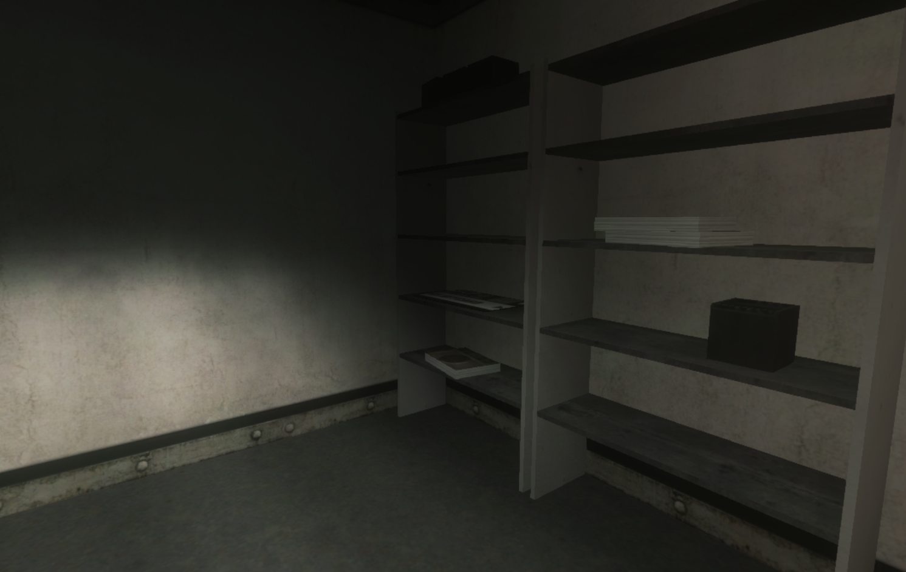
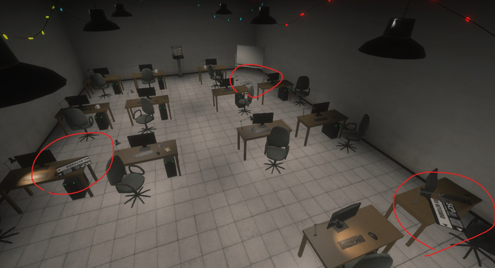
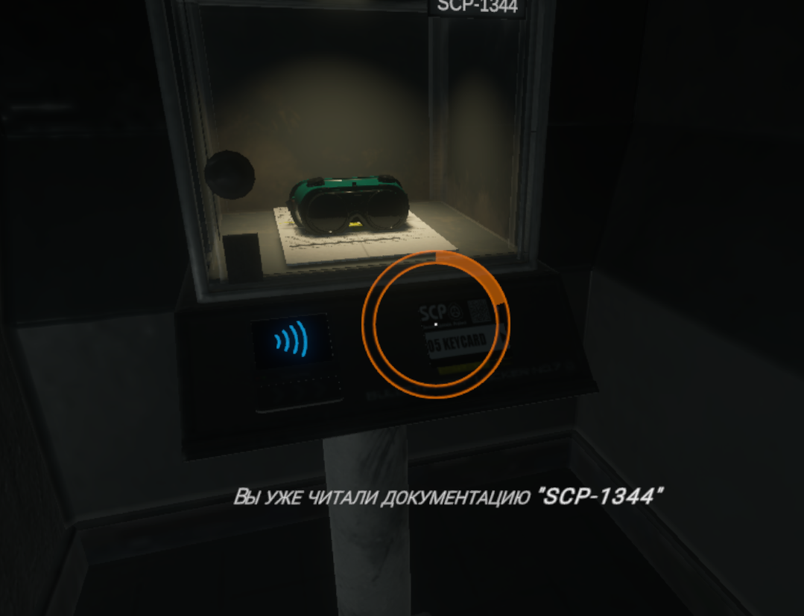

# ❄️ 22 декабря

## Общие изменения

* Увеличено время неуязвимости новоприбывших отрядов МОГ и ПХ с **3 секунд** до **5 секунд**
* Отключено оповещение при бане игрока

## MediumRP

### Интерактивные документации

1. Изменены позиции некоторых документаций и добавлены новые документации (SCP-1344, SCP-1507, SCP-2536, SCP-956 и SCP-559)

<figure><figcaption>
SCP-096
</figcaption></figure>

<figure><figcaption>
Система Аварийного Перезапуска (находится в прямом коридоре ЗТС с трубами и вентиляцией)
</figcaption></figure>

<figure><figcaption>
SCP-106 (на коробке слева)
</figcaption></figure>

<figure><figcaption>
Альфа Боеголовка
</figcaption></figure>

<figure><figcaption>
Micro H.I.D
</figcaption></figure>

<figure><figcaption>
SCP-173 (на полу) SCP-1344 (закреплено за пьедесталом, а не за комнатой)
</figcaption></figure>

<figure><figcaption>
SCP-049
</figcaption></figure>

<figure><figcaption>
SCP-1507 (полка в GR-18)
</figcaption></figure>

<figure><figcaption>
SCP-956 (справа) SCP-2536 (слева) SCP-559 (у доски на полу)
</figcaption></figure>

2. Теперь показывается название документа в подсказке, если ты уже знаешь информацию про эту документацию

<figure><figcaption>
Вот и сам пример
</figcaption></figure>

### Известные ошибки

* Не работает иммерсивная система перемещения по лифтам у SCP-106
* Цели SCP-096 могут использовать лифты без ограничений
