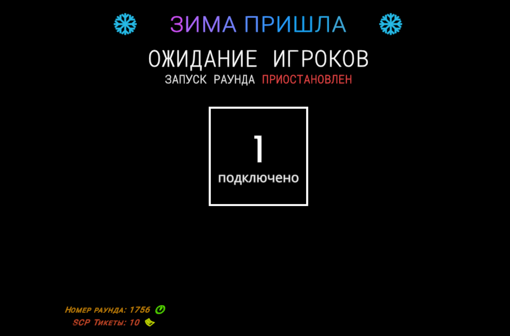

# ❄️ 3 декабря

## Общие изменения

* Изменён дизайн текст в лобби ожидания на **ЗИМА ПРИШЛА**

<figure><figcaption></figcaption></figure>

## Изменения на публичной бете 14.0

* Перенесён плагин на **голосовые реплики**
* Перенесён плагин на **общий голосовой чат у SCP**
* Перенесён модуль плагина на **умную автоочистку трупов и предметов**
* Перенесён модуль плагина на **систему против АФК**
* Перенесён модуль плагина на **новую систему подбора SCP**
* Перенесён модуль плагина на **QOL фишки**\
  Потужная гравитация у трупов, и при возрождении SCP-049-2 появляются на месте SCP-049
* Убран модуль плагина на **автоматическую боеголовку**\
  В игре уже добавлена своя система **Deadman Switch**
* Убрана **"скелетонизация" трупов**\
  No more SCP-3114 💀

<figure><figcaption></figcaption></figure>

