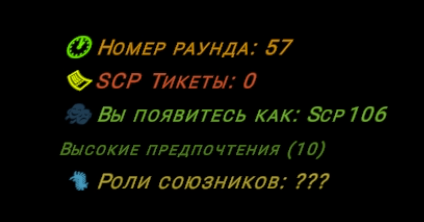

# 🌿 18 мая

Уже 18 мая в 21:00 по Мск. выйдет обновление 14.1. Тут мне больше нечего добавить 🥴

### Общие изменения для ПБТ 14.1

1.  Изменения для системы "Динамичное лобби"

    1. Добавлен пункт "Вы появитесь как ..."\
       [Теперь можно заранее узнать предварительную роль, за которую вы появитесь в раунде](#user-content-fn-1)[^1]
    2. Добавлен пункт "Роли союзников ..."\
       [Он отображает возможные роли союзных SCP](#user-content-fn-2)[^2]

    \\

    1. В Server-Specific появились 2 новые настройки
       1. Выравнивание текста
       2. Размер текста

    
<figure><figcaption></figcaption></figure>

2.  Изменения для системы "Динамичный список игроков"

    1. В Server-Specific появились 2 новые настройки
       1. Шаблон списка игроков
       2. Размер текста

    <figure><figcaption></figcaption></figure>
3. Изменения для системы "Автоматическая очистка"
   1. Очистка по времени более не затрагивает предметы в карманном измерении SCP-106
4. Дополнена информация в [sistema-podbora-scp.md](../../newbies/obshii-spisok/sistema-podbora-scp.md "mention")
   1. Добавился новый пункт про "несправедливое снятие тикетов" в [#polozheniya-raboty-originalnoi-sistemy-northwood](../../newbies/obshii-spisok/sistema-podbora-scp.md#polozheniya-raboty-originalnoi-sistemy-northwood "mention") и в [#polozheniya-raboty-novoi-sistemy](../../newbies/obshii-spisok/sistema-podbora-scp.md#polozheniya-raboty-novoi-sistemy "mention")
5. Какая-то оптимизация, бла бла бла и другая ненужная вам информация


Демонстрация изменений


[^1]: Система делает эту проверку раз в 3 секунды, так что нет гарантий, что в последние 3 секунды до начала раунда результат не изменится

[^2]: Роли отображаются только тогда, когда ваша предварительная роль относится к команде SCP и кроме вас есть другие игроки, которые предварительно появятся за SCP
