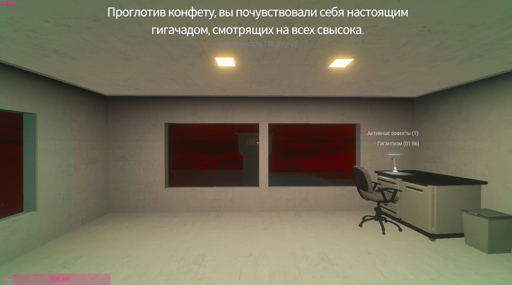
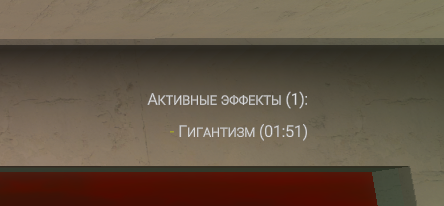
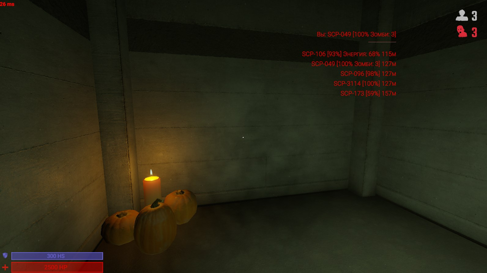

# 🍁 9 ноября

## Анти АФК

Возвращена система автоматической замены АФК игрока с возможностью включения/отключения и настройки через [server-specific-settings.md](../../newbies/obshii-spisok/server-specific-settings.md "mention"). По умолчанию, эта настройка отключена.

<figure><figcaption></figcaption></figure>

В поле **"Роли для замены"** можно указать предпочтительные роли для замены (указываются номера роли через пробел). Для подтверждения указанных ролей для замены, не забудьте нажать на <kbd>ENTER</kbd>.

**Доступны следующие классы для замены:**

<table><thead><tr><th>Название Роли</th><th>Номер Класса</th><th data-hidden></th></tr></thead><tbody><tr><td>ClassD</td><td>1</td><td></td></tr><tr><td>NtfSpecialist</td><td>4</td><td></td></tr><tr><td>Scientist</td><td>6</td><td></td></tr><tr><td>ChaosConscript</td><td>8</td><td></td></tr><tr><td>NtfSergeant</td><td>11</td><td></td></tr><tr><td>NtfCaptain</td><td>12</td><td></td></tr><tr><td>NtfPrivate</td><td>13</td><td></td></tr><tr><td>FacilityGuard</td><td>15</td><td></td></tr><tr><td>ChaosRifleman</td><td>18</td><td></td></tr><tr><td>ChaosMarauder</td><td>19</td><td></td></tr><tr><td>ChaosRepressor</td><td>20</td><td></td></tr></tbody></table>

## Голосовые Реплики

Они вернулись [golosovye-repliki.md](../../newbies/obshii-spisok/golosovye-repliki.md "mention").

1.  Появились 2 настройки в [server-specific-settings.md](../../newbies/obshii-spisok/server-specific-settings.md "mention").\

    <figure><figcaption></figcaption></figure>
2. Удалены команды `.changevoicename` и `.changevoicemode`.

## Голосовой чат SCP

Появилась возможность отключить прослушивание голосового чата SCP (в т.ч и общего голосового чата SCP с людьми) через настройку в [server-specific-settings.md](../../newbies/obshii-spisok/server-specific-settings.md "mention").

<figure><figcaption></figcaption></figure>

## Донат-конфеты

Теперь можно увидеть название эффекта и длительность действия эффекта от донат-конфеты.

<figure><figcaption></figcaption></figure>

<figure><figcaption></figcaption></figure>

## Отображение союзников SCP

И эта фишка вернулась с приятными визуальными изменениями.

1. Добавлен разделитель
2. Теперь отображается не больше **5** ближайших союзников SCP и сортировка происходит в порядке увеличения расстояния до игрока.

<figure><figcaption></figcaption></figure>
