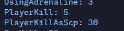

# 🎃 Хэллоуин

Одно из самых интересных игровых событий, которое отмечается в октября.

Мы, как и разработчики игры, готовим свои собственные изменения для такого весёлого игрового события.&#x20;

## Конфеты

И конфеты не обошлись без изменений шансов выпадения и исправлений недочётов базового кода игры.

### Шансы выпадения

Одно из главных изменений - возвращение **коричневой** конфеты. Дристайте себе на здоровье :thumbsup:

| Название конфеты | Шанс выпадения |
| ---------------- | -------------- |
| Красная          | 10,3%          |
| Жёлтая           | 10,3%          |
| Фиолетовая       | 10,3%          |
| Радужная         | 10,3%          |
| Зелёная          | 10,3%          |
| Белая            | 9,4%           |
| Серая            | 9,3%           |
| Коричневая       | 5,6%           |
| Чёрная           | 5,6%           |
| Синяя            | 4,7%           |
| Розовая          | 3,7%           |
| Злая             | 0,09%          |

### QOL

1. Красная конфета не наносит урон пламенем союзникам (эффект **Ожог** выдаётся и метка попадания всё равно будет отображаться).
2. Розовая конфета не наносит урон союзникам.

## Страшилки

Весёлые штуки, что могут вызвать лёгкий дискомфорт или ужас.

### Ninja.b3d

Одна из крипипаст, созданная усилиями Meganeko и участниками команды с Discord сервера SCP Classic, - та самая, на основе которой я, CosmosZvezdochkin, сделал простенький плагин в прошлом 2024 году. И в этом году у нашего любимого ниндзи годовщина, в честь которой я усовершенствовал его код и дополнил его появление звуковым сопровождением.

<figure><figcaption></figcaption></figure>

<figure><figcaption></figcaption></figure>

### SCP-953

Та самая белая смеющаяся рожа в темноте. И да - это пасхалка на SCP-953. Чтобы она появилась, нужно выполнить некоторые условия, которые я, конечно, не озвучу.

<figure><figcaption></figcaption></figure>

### Случайные страшные звуки

В некоторых комнатах комплекса в случайный момент времени могут проигрываться различные звуки, к примеру, в Test Room телефон может издавать разные звуки (набор номера и обрыв связи).


Эти звуки не слышат **SCP.**


## SCP-3114

Ну и куда же нам без смешных изменений для самого смешного игрового SCP в этой игре :smirk:

### Принудительная система маскировки

При естественном появлении игроку на SCP-3114 даётся **20 секунд** для выбора маскировки (в ином случае сервер сам выберет маскировку для игрока).

Если замаскироваться под **сотрудника Д-Класса**:

* Игрока перемещает в одну из **камер Д-Блока**.

Если замаскироваться под **научного сотрудника**:

* Игроку выдаётся аптечка
* Игрока перемещает в одну из комнат появления научного сотрудника (**GR-18**, **WC-00**, **VT-00**, **КС SCP-330** или один из **КПП**)

Игрок на SCP-3114 не сможет выйти из этой маскировки пока у игрока не исчезнут все дополнительные очки здоровья (AHP) или пока не истечёт таймер в **180 секунд**.


По истечению таймера появится подсказка о возможности выйти из маскировки.


### Место появления

Вместо старой **КС SCP-173** в ЗЛС местом появления SCP-3114 была выбрана **комната Альфа-Боеголовки** в ЗТС по следующим причинам:

* Игроки на людях не успеют за 20 секунд дойти туда (при нормальных условиях).
* Игроки в ЗЛС не узнают под кого замаскировался SCP-3114.
* SCP-3114 не успеет никому нанести ущерб в первые 20 секунд от начала раунда.

<figure><figcaption></figcaption></figure>

### Изменения основных способностей

#### Обычная атака

1. Восстанавливает игроку **15%** выносливости от макс. значения выносливости.
2. Накладывает КД на восстановление выносливости у жертвы.

#### Удушение

1. Восстанавливает игроку **6%** выносливости от макс. значения выносливости за каждый тик урона.
2. Крадёт у жертвы **6%** выносливости от макс. значения выносливости за каждый тик урона.
3. Накладывает КД на восстановление выносливости у жертвы.

#### Маскировка

1. Даёт **75** очков дополнительного здоровья (AHP) с эффективностью поглощения урона в **80%**.
2. При снятии маскировки все очки дополнительного здоровья (AHP) пропадают.
3. При отсутствии очков дополнительного здоровья (AHP) маскировка сбрасывается.

### Новые способности


Все перечисленные ниже способности активируются на клавишу включения Noclip (по умолчанию **ALT**)


#### Трупный газ

1. Доступна только под **активной маскировкой**.
2. При активации проигрывает легендарный звук **fart\_reverb.ogg**.
3. В радиусе 3-х метров накладывает на людей неприятные эффекты (размытие экрана и оглушение на 10 секунд).
4. В радиусе 1,5 метров накладывает на людей эффект ослепления на 2 секунды.
5. Время отката **30 секунд** между повторным использованием способности.
6. На 1 маскировку даётся 2 заряда способности.

#### Танцы

1. Доступна только **без** активной маскировки.
2. Позволяет танцевать (более удобная замена чит-коду gingerbread).

#### Использование карт доступа

Почему-то в этом году убрали возможность использовать карты доступа под активной маскировкой у SCP-3114. Поэтому мы вернули эту возможность, и теперь необязательно кидать карты доступа через **T** для открытия дверей. Пользуйтесь картами доступа на здоровье :heart:

### Как поиграть за SCP-3114

А вот тут разработчики игры приятно удивили. Они добавили SCP-3114 в настройку предпочтений спавна SCP.

[sistema-podbora-scp.md](sistema-podbora-scp.md "mention")

<figure><figcaption></figcaption></figure>
