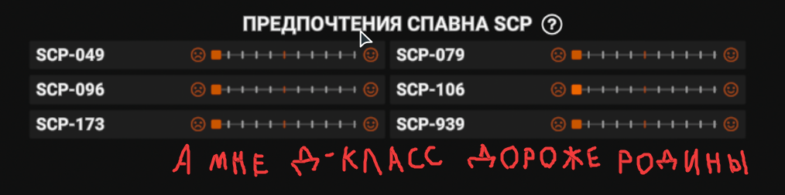

# 🎲 Система подбора SCP

Что такое тикеты ?

**Тикеты** - билетики, количество которых влияет на шанс спавна за команду SCP в раунде

По умолчанию, игроку даётся 10 тикетов. С каждым началом раунда игроку добавляется по 2 тикета, если он не появляется за команду SCP.

Если игрок появился за команду SCP, то количество тикетов сбрасывается до 10

## Что такое предпочтения спавна SCP ?

**Предпочтения спавна SCP** - пользовательская настройка в категории _“Прочее”_ (доступна как и в Главном Меню, так и в Esc-Меню)

<figure><figcaption>
Местоположение настройки "Предпочтения спавна SCP"
</figcaption></figure>

## Положения работы оригинальной системы Northwood

❌ Игроки с наибольшим кол-вом тикетов на сервере не всегда появляются за SCP (есть небольшой рандом)

❌ Сервер выбирает нужные роли SCP для спавна до начала подбора игроков (т.е не учитываются предпочтения подобранных игроков)

❌ Авось да небось игрок появится за предпочитаемый класс SCP

❌ Игрок может появится за SCP, даже если он не хочет играть за SCP (из-за чего часто игроки перезаходят на сервер)

## Положения работы новой системы

✅ Выбираются игроки с наибольшим количеством тикетов (и так по убыванию)

✅ Сервер выбирает роли SCP в зависимости от предпочтений игроков в списке

✅ Учитываются предпочтения игроков (даже если они левее середины)

✅ Игрок может поставить все предпочтения левее середины, чтобы по возможности не играть за SCP


Если сервер не находит нужное кол-во игроков для спавна за команду SCP, то сервер добирает игроков в зависимости от их количества тикетов (даже если игрок поставил все предпочтения левее середины)


## Я хочу играть только за одного SCP

В настройках "Предпочтения спавна SCP" поставьте своего любимого SCP правее середины, а остальных SCP ставьте левее середины

<figure><figcaption>
Предпочтения SCP-079 на максимальном уровне
</figcaption></figure>

## У меня есть несколько любимых SCP, за которых я не против поиграть

В настройках "Предпочтения спавна SCP" поставьте своих любимых SCP правее середины в порядке, где SCP, который находится правее, является более предпочтительным

<figure><figcaption>
Предпочтения 3-х SCP расставлены в порядке возрастания правее середины
</figcaption></figure>

## Я не хочу играть за SCP

В настройках "Предпочтения спавна SCP" поставьте всех SCP левее середины


Могут быть ситуации, когда сервер не находит нужное кол-во игроков для спавна за SCP и начинает добирать, опираясь на количество тикетов. В этом случае настоятельно рекомендую расставить все настройки "Предпочтения спавна SCP" в порядке, где SCP, который находится ближе к середине, является более предпочтительным


<figure><figcaption>
Предпочтения левее середины, но у 3-х SCP они расставлены в порядке возрастания
</figcaption></figure>

<figure><figcaption>
Все предпочтения на минимуме
</figcaption></figure>

## ЧАВО


**А сколько я могу накопить** [**тикетов**](#user-content-fn-1)[^1] **?**

От 10 до 1486



**Почему я появился за своего нелюбимого SCP ?**

Либо ты игрок из категории “А я не читаю новости. Че там случилось ?”, либо тебе не повезло и сервер не смог найти подходящее число игроков для спавна за SCP. В любом случае перечитай документ и перепроверь свои настройки "Предпочтения спавна SCP"



**Я могу поменять настройки "Предпочтения спавна SCP" до начала раунда уже на сервере ?**

Да, можно, новые настройки "Предпочтения спавна SCP" сразу отправляются на сервер (таков базовый код игры)



**Какие ограничения у спавна SCP ?**

1. Scp079 не будет выбран, если нужен только 1 SCP
2. Scp079 и Scp096 не будут выбраны вместе, если нужно только 2 SCP


<figure><figcaption></figcaption></figure>

[^1]: **Тикеты** - билетики, количество которых влияет на шанс спавна за команду SCP в раунде
