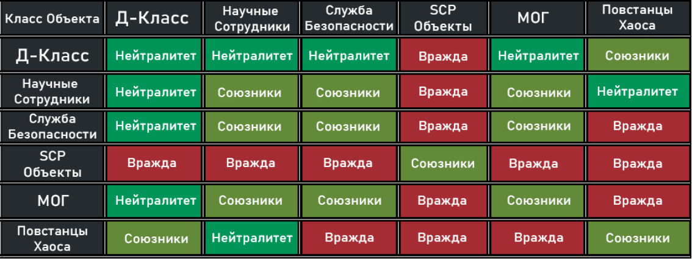

# 🟣 Classic

## Таблица взаимоотношений классов

<figure><figcaption></figcaption></figure>

## Правила

### C1. Руин

Запрещено мешать и руинить игру союзным классам


**Примеры нарушений**

1\. Намеренное нанесение урона по союзникам

2\. Закрытие дверей перед союзниками

3\. Порча и воровство любых вещей союзников

4\. Самоубийство за SCP

5\. Развязывание врага / нейтрала в зоне побега

6\. [Способствование созданию врагов](#user-content-fn-1)[^1] для своих союзников



**Исключение**

1. Закрытие дверей перед союзниками разрешено только при угрозе жизни\
   (побег от SCP, перестрелка с врагом и т.п.)
2. В конце раунда это правило не действует



**Наказание**

Предупреждение -> 3 часа -> 12 часов -> 3 дня -> 2 недели -> 1 месяц


### C2. Кооперация

Запрещено кооперироваться между враждебными классами


**Исключения**

1. Кооперация между враждебными друг к другу классами разрешена, если одна из сторон безоружна или связана (не касается SCP)
2. SCP враждебны ко всем, но не обязаны убивать людей, находясь с ними в запертом помещении (исключение: SCP-106)
3. В конце раунда это правило не действует



**Наказание**

Предупреждение -> 3 час -> 12 часов -> 2 дня -> 1 неделя -> 1 месяц


### C3. Кемпинг

Запрещено SCP-объекту поджидать людей в какой-либо позиции более 90 секунд ("кемпинг")


**Примечание**

Для того, чтобы сбросить таймер кемпинга, необходимо уйти, как минимум, за 3 комнаты от игрока



**Исключения**

1. "Скромник" (SCP-096) может кемпить 3 минуты
2. "Старый ИИ" (SCP-079) может кемпить
3. SCP можно кемпить на Gate-A и Gate-B
4. SCP можно кемпить Комнату Боеголовки в ЗТС



**Наказание**

Предупреждение -> 3 час -> 12 часов -> 2 дня -> 1 неделя -> 1 месяц


### C4. Нейтральные классы и безоружные враги

Запрещено намеренно убивать связанного врага, безоружного врага в сопровождении человека противоположной ему команды и игрока нейтрального класса без веской на то причины


**Примечание**

Намеренное убийство связанного врага, безоружного врага в сопровождении человека противоположной ему команды и игрока нейтрального класса разрешено только в случае:

* Попытка побега / неподчинение приказам
* Сопротивления
* Неподчинения [адекватным приказам](#user-content-fn-2)[^2]



**Примеры нарушений**

1. Убийство сотрудника Д-Класса в сопровождении научного сотрудника
2. Убийство сотрудника Д-Класса, у которого оружие было в инвентаре, но не в руках
3. Убийство безоружного бойца МОГ в сопровождении бойца ПХ
4. Убийство безоружного научного сотрудника сразу после того, как вы его заметили



**Исключение**

1. При обнаружении игрока [противоположного вам нейтрального класса](#user-content-fn-3)[^3] с [оружием в руках](#user-content-fn-4)[^4] и/или при поднятии им оружия на ваших глазах он становится для вас врагом, пока он не выбросит оружие и не прекратит сопротивление
2. В конце раунда это правило не действует



**Наказание**

+1 часа бана за каждого убитого нейтрального класса и/или связанного врага


### C5. Убийство союзника

Запрещено убийство союзника по какой-либо причине


**Исключение**

В конце раунда это правило не действует



**Наказание**

**+**&#x33; часа бана за каждого убитого союзника


### C6. Посторонние, громкие и неприятные звуки

Запрещено транслировать через микрофон [посторонние звуки](#user-content-fn-5)[^5] в [глобальные голосовые каналы](#user-content-fn-6)[^6].

Запрещено воспроизводить чрезмерно громкие и/или неприятные звуки


**Примечание**

Администрация вправе потребовать от вас прекратить проигрывать посторонние звуки в случае, если они раздражительны или неуместны



**Исключения для посторонних звуков**

1. Ивент-Мастера могут на своих ивентах разрешать игрокам транслировать [посторонние звуки](#user-content-fn-7)[^7]
2. Программы для изменения голоса (VoiceChanger)
3. В конце раунда разрешено воспроизводить [посторонние звуки](#user-content-fn-7)[^7]



**Наказание**

Предупреждение -> 3 часа -> 1 день -> 3 дня


### C7. Оскорбления

Запрещено оскорблять игроков.

Запрещена поддержка взглядов и идеологий, подразумевающих проявление ненависти или нетерпимости к каким-либо кругам лиц на расовой, национальной, этнической или других почвах.


**Исключения к** [**личным оскорблениям**](#user-content-fn-8)[^8]

1. Если тот, кого вы оскорбили, не считает себя оскорблённым, правило не будет считаться нарушенным
2. Коверкание никнейма не будет являться оскорблением
3. Легкие оскорбления рода: Дурак, идиот, козёл и т.д. - не будут являться оскорблением



**Наказание**

Предупреждение -> 6 часов -> 12 часов


### C8. Задержка раунда

Запрещено намеренно задерживать раунд более двух минут

Намеренной задержка раунда будет считаться в случае, если последняя цель/цели для SCP была оповещена о том, что задерживает раунд


**Примечание**

Задержкой также будет считаться, когда группа людей намеренно не совершают каких-либо действий в сторону завершения раунда, всё также являясь об этом осведомлёнными



**Исключение**

Ивент-Мастер имеет право отменить данное правило на время проведения ивента



**Наказание**

Перевод нарушителя/нарушителей в наблюдатели


### C9. Обман и помеха работе администрации

Запрещено обманывать сотрудников проекта во время проведения разборок, выдавать себя за администрацию сервера и намеренно мешать сотруднику при исполнении служебных обязанностей.


**Примеры**

1. Помеха при проведении ивента
2. Дезинформирование администрации
3. Спам бессмысленными внутриигровыми жалобами и вызовами администрации
4. Намеренное убийство администратора при разборках



**Наказание**

Предупреждение -> 3 часа -> 1 день


### C10. Реклама

Запрещено рекламировать сторонние проекты, постороннее ПО, аккаунты социальных сетей (Youtube, Twitch и прочие платформы), игорные сайты (интернет-казино) и сайты по ставкам.


**Исключение**

Игрокам, имеющим роль “Контент-Мейкер” разрешено рекламировать свои социальные сети



**Наказание**

Предупреждение -> 1 день -> 7 дней -> Глобальная блокировка на всех серверах проект


### C11. [Рейдерские атаки](#user-content-fn-9)[^9] и стороннее ПО

Запрещено проводить [рейдерские атаки](#user-content-fn-9)[^9] и использовать сторонние программы, дающие серьезное преимущество перед другими игроками.

В случае подозрения игрока на использование стороннего ПО администрация сервера имеет право провести проверку на наличие или факт использования стороннего ПО через Discord.

Отказ от проверки, отказ от использования Discord для прохождения проверки, намеренное затягивание процесса проверки и выход с проверки расцениваются как нарушение этого правила.


**Включает, но не ограничивает**

Использование читов и [ограничителей пропускной способности](#user-content-fn-10)[^10], многократное нарушение правил, злоупотребление эксплойтами и багами игры, DoS - DDoS-атаки, стресс-тестеры, организованное нарушение правил, подстрекательство, попытка нарушить работоспособность сервера и т.п.



**Наказание**

Глобальная блокировка на всех серверах проекта


### C12. Труднодоступные места

Запрещено в попытке получить преимущество над противником залезать в места недоступные для определенных ролей.


**Наказание**

Перевод нарушителя в наблюдатели -> предупреждение -> 3 часа -> 12 часов


## Важная информация

* Правила Classic являются едиными для каждого игрока.

> Незнание правил не освобождает от ответственности

* Если что-то не предусмотрено правилами, то это не значит, что вы можете так делать
* Если вы увидели нарушение на нашем сервере, то смело подавайте жалобу, нарушитель будет наказан по всей строгости. Жалобу можно подать как на игрока, так и на администратора
* Другие игроки или свидетели не являются доказательством нарушения

### Нетривиальные случаи


Отряд СБ выводит сотрудника Д-Класса и один из СБ развязывает сотрудника Д-Класса в зоне побега, из-за чего сотрудник Д-Класса сбегает и становится ПХ. Какое правило нарушено ?

**Ответ:** C1



Научный сотрудник сбегает из комплекса. Когда он становится МОГ, из него выпадают его предметы. Другие бойцы МОГ подбегают к его предметам и подбирают их без спроса. При просьбе сбежавшего научного сотрудника их вернуть, они отказываются их вернуть. Что здесь нарушено ?

**Ответ:** C1



Научный сотрудник открыл пьедестал с SCP-500. Подходит МОГ и забирает SCP-500. Что здесь нарушено ?

**Ответ:** Ничего (SCP-500 изначально не принадлежал научному сотруднику)



СБ ведёт связанного сотрудника Д-Класса в оружейную комнату. Войдя внутрь, СБ приказывает ему подобрать оружие. Сотрудник Д-Класса отказывается исполнять приказ, СБ его убивает. Что здесь нарушил СБ ?

**Ответ:** C4 (Сотрудник Д-Класса не обязан выполнять [неадекватный приказ](#user-content-fn-2)[^2])


Если у вас остались какие-то вопросы по правилам сервера, свяжитесь с нами в канале [#🔧техподдержка](https://discord.com/channels/468338494624890881/1026183726880796752) нашего [Discord сервера](https://kyles.ru/discord)

## Правила Администрации

### A1. Вмешательство в игровой процесс

Администрация имеет право вмешаться в игровой процесс только тогда, когда игроку не угрожает опасность


**Наказание**

От Выговора до Варна


### A2. Жалобы

Администратору нельзя игнорировать жалобы от игроков


**Примечания**

1. Администратор при разборках обязан вызвать жертву и нарушителя. Если пострадавшего не предусмотрено ситуацией, соответственно, вызывать и некого
2. Если пострадавший прощает нарушителя, то Администратор обязан отпустить нарушителя



**Исключения**

1\. Жалоба не обоснована/неадекватна

2\. Администратор находится в отпуске

3\. Администратору разрешено игнорировать жалобы и вопросы игроков, если он ведет слежку за потенциальным читером



**Наказание**

От Беседы с Администратором до Варна


### A3. Аккаунты

Администратору запрещено играть с других аккаунтов или передавать свой аккаунт другим людям


**Примечание**

Запрещено менять свой ник в дискорде (ник должен соответствовать нику в стиме)



**Наказание**

От Беседы с Администратором до Выговора


### A4. Вопросы игроков

Если у игрока появляются вопросы насчёт игры или правил, то администратор обязан ответить в админ. башне за Обучение


**Исключение**

Вопрос неадекватный



**Наказание**

От Беседы с Администратором до Выговора


### A5. "Role Management" и "Administration"

"Role Management" и "Administration" можно использовать в случае, если кто-то забагался на разборках, если кто-то из SCP вышел из игры, и для дальнейшего администрирования

Если SCP потерял соединение/был забанен/вышел из игры/SCP умер специально до 5 минут от начала раунда, то администратор обязан поставить другого игрока или себя за SCP, которым он был


**Примечания**

1\. Переводить игрока/администратора в SCP можно в случае, если он согласился

2\. Если администратор уже заспавнил себя за SCP менее 5 раундов назад, то до истечения этого срока он не может спавнить себя за SCP

3\. Администратор обязан уведомить через Broadcasting игроков о том, что SCP был восстановлен из-за причины, которые перечислены в самом пункте правил A5



**Исключение**

Прошло более 5 минут от начала раунда



**Наказание**

От Беседы с Администратором до Выговора


### A6. Отпуск

Администратор во время отпуска должен скрывать свой тег


**Примечание**

Администратор, не скрывший свой тег, находится при исполнении обязанностей (должен рассматривать жалобы)



**Наказание**

Беседа с Администратором


### A7. Поведение администрации

Администратор должен быть сдержанным, иметь стальную волю, а так же не поддаваться ни на единую провокацию


**Наказание**

От Беседы с Администратором до Варна


### A8. Наказание без причины

Администратору запрещено банить/кикать или выдавать предупреждение игроку без причины. Также запрещено выдавать бан/предупреждение кому-либо из администрации. Администратор должен объяснить игроку его нарушения и выдать бан по правилам.

> Если администратор банит игрока, то он обязан написать причину в админ-панели


**Примечания**

1\. Администрация обязана забанить игрока/администратора, если поступило распоряжение со стороны руководства Classic, даже если этот игрок не нарушал

2\. Глава отдела Classic может на свое усмотрение выдать любой срок бана не превышающий 30-и дней



**Наказание**

От Выговора до Варна\
(в случае неверно выданного наказания или выдачи наказания без причины)


### A9. Лив игрока

Если игрок покидает игру на разборках, то администрация действует по следующей инструкции

Игрок нарушил C5 или C4 -> Наказание удваивается\
\
Было совершено любое другое нарушение -> Наказание нарушителя переходит на следующую ступень


**Примечание**

Если администрация не успела выдать предупреждение за нарушение и человек вышел с сервера, то ему полагается следующая ступень наказания вместо предупреждения (также работает и с жалобами в Discord)



**Наказание**

От Выговора до Варна\
(в случае неверно выданного наказания)


### A10. Наблюдение

Если администратор при онлайне 20+ находится на сервере, то он обязан находиться в Надзирателях раз в три раунда


**Примечание**

Разрешено играть 2 раунда, но в следующем раунде администратор обязан модерировать



**Исключение**

Если на сервере присутствует четыре администратора, то это правило не действует



**Наказание**

От Беседы с Администратором до Варна


### A11. Разборки

Разборки с игроками проводятся в админ башне


**Примечания**

1\. Администратору, проводящему разборки с SCP, требуется заспавнить себя за SCP-049 в админ башне. Дальнейшее выяснение обстоятельств должно проводиться в войс-чате с SCP.&#x20;


### A11.1. Администратору запрещено спавнить игрока за Обучение для разборок


**Примечание**

Администратор обязан вернуть игрока на то место, где он был до проведения разборок



**Исключения**

1\. Игрок находится в наблюдателях

2\. Игрок начинает использовать оружие против администратора на разборках



**Наказание**

От Беседы с Администратором до Варна


### A12. Map Control

"Map Control" обязан использовать только в случае, если игрок был заперт более двух минут или надо вернуть игрока после разборок


**Наказание**

От Беседы с Администратором до Выговора


### Важная информация

* В конфликтах между админами разбираются глава отдела или зам. главы отдела
* По вопросам администрирования сервера и использования админ-панели писать главе отдела или зам. главы отдела
* Наказание будет выдаваться в зависимости от тяжести нарушения Администратора

## Особенности игрового процесса

### 1. Массовые нарушения

Если произошло больше 3-х убийств или было совершено более 3-х нарушений за один раунд, то администратор вправе забанить нарушителя без разборок, в зависимости от обстоятельств

### 2. "Косвенное убийство или ненамеренное нанесение урона"

При ненамеренном нанесении урона или совершении косвенного убийства союзника или нейтрального класса (не намеренное убийство в иных случаях), администратор должен простить нарушителя

## Справочный материал

1. **TK** - Тим килл / Убийство союзника (Используется при выдачи блокировки за убийство союзников по правилу C5)
2. **ДК** - Д килл / Убийство сотрудника Д-Класса (Используется при выдачи блокировки за убийство сотрудника Д-Класса без причины по правилу C4)
3. **УК** - Убийство учёного / Убийство научного сотрудника (Используется при выдачи блокировки за убийство научного сотрудника без причины по правилу C4 исключение)
4. **ПХ** - повстанцы хаоса
5. **СБ** - служба безопасности / охрана комплекса
6. **МОГ -** Мобильная Оперативная Группа
7. **НС** - научный сотрудник / учёный
8. **Тиминг** / **Кооп** - Кооперация / Team (Используется при выдачи предупреждения/блокировки за кооперацию с враждебным классом по правилу C2)
9. **Кемперство** - Поджидать / Camping (Используется при выдачи предупреждения/блокировки за SCP, которые поджидают людей очень долго по правилу C3)
10. **Лив** - Покинул разборки / leave showdown (Используется при дополнительном сроке наказания, когда игрок покидает сервер во время разборок его нарушения)

[^1]: Под этим подразумевается намеренная и безосновательная сдача самого себя в плен вражескому классу

    **Пример:**\
    Отряд МОГ сдался одному сотруднику Д-Класса возле Escape-Зоны, тем самым сменив свой класс на Повстанцев Хаоса

[^2]: **Признаки адекватного приказа:**

    1. Не предполагает наличие невыполнимого действия
    2. Не ведёт к нарушению правила
    3. Не ведёт к смерти исполняющего
    4. Связан только с действиями игрового персонажа (смена позиции, направление камеры, взаимодействие с инвентарём и запрет включения микрофона)

    **Примеры неадекватного приказа:**

    1. Подбери оружие
    2. Посмотри на скромника
    3. Спрыгни в пустоту
    4. Скажи "привет"

[^3]: То есть сотрудник Д-Класса не становится врагом для других сотрудников Д-Класса, но становится вражеским классом для МОГ, СБ и вооруженных научных сотрудников

[^4]: Да, именно **В РУКАХ**, а не в инвентаре

    \
    **Оружием считается:**

    \- Огнестрельное оружие

    \- Оружие ближнего боя

    \- Экспериментальное оружие

    \- Осколочные гранаты

    \- Другие предметы и устройства способные нанести урон

[^5]: Soundpad, телефон у микрофона и другие средства воспроизведения сторонних звуков

[^6]: **Глобальные голосовые каналы:**

    1. Интерком
    2. Наблюдатели
    3. Лобби ожидания
    4. Общий голосовой канал между SCP
    5. SCP-1576 "Граммофон" ("Фонограф")
    6. Рация

[^7]: Но не громкие и неприятные

[^8]: Оскорбление конкретного игрока

[^9]: **Рейдерская атака** - это намеренное нарушение правил сервера\
    \
    **Пример:** Намеренное убийство союзников

[^10]: **Ограничители пропускной способности** - программы, целью которых является ограничение входящего/исходящего интернет-трафика в игре для получения существенного преимущества над другими игроками
